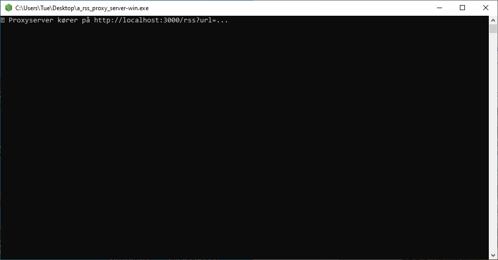
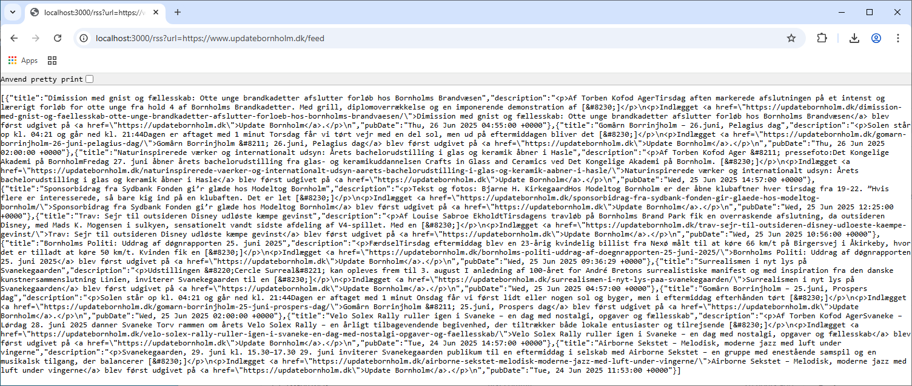

# A RSS Proxy Server

En simpel RSS Proxy Server, som kører lokalt på din maskine.

---

## 🖥 Funktioner

- Starter en RSS Proxy Server op på http://localhost:3000/rss?url=
- Indtast http://localhost:3000/rss?url=https://www.updatebornholm.dk/feed i browser
- Få JSON svar
- Appen kan pakkes til Windows, macOS og Linux




---

## 📦 Installation (Udvikling)

1. **Klon projektet**

```bash
git clone https://github.com/7u5a/a_rss_proxy_server.git
cd a_rss_proxy_server
```

2. **Installer afhængigheder**
```bash
npm install
```

3. **Start appen i udviklingstilstand**
```bash
npm start
```

## 🛠 Byg som en app

Sørg for at pkg er installeret globalt (eller via 'devDependencies').
```bash
npm run build
```
Output findet i 'build/'-mappen
